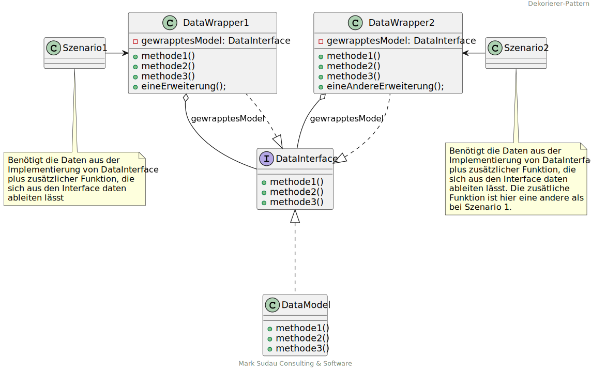
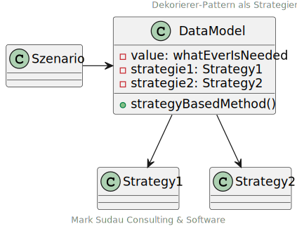

# <mark>Dekorierer-Pattern (engl. Wrapper)

## Dekorierer zur Erweiterung der Funktion eines Interfaces

### Beschreibung
Der Dekorierer klammert die Implementierung eines Interface um die Funktionalität des Interfaces zu erweitern, ohne
weiterer Ableitungen zur konkreten Implementierung zu benötigen. Dabei delegiert der Dekorierer alle Aufgaben 
an die eigentliche Implementierung des Interfaces.

Der Dekorierer findet Anwendung, wenn:
 + einem Objekt zusätzliche Funktionaliät gegeben werden soll, ohne die Implementierung der eigentlichen Klasse 
   ändern zu müssen
 + einem Objekt Funktionalität zu entfernen, ohne die Implementierung der eigentlichen Klasse
   ändern zu müssen

| Vorteile                                                                                                  | Nachteile                                                                                                              |
|-----------------------------------------------------------------------------------------------------------|------------------------------------------------------------------------------------------------------------------------|
| Funktionalität einer Klasse kann einfach erweitert oder reduziert werden                                  | Wenn man sich des Patterns nicht bewusst ist, können unbemerkt Abhängigkeiten in die nicht erlaubte Bereiche entstehen |
| Mit einer geeigneten Granularität, kann der Funktionsumfang fast beliebig erweitert und kombiniert werden |                                                                                                                        |
| Die Anzahl der Objekte steigt zwar, allerdings ohne eine Vervielfachung der zugrundeliegenden Daten       |                                                                                                                        |
| Reduziert Wertemapping bei der Konvertierung von einer Klasse in eine Andere                              |                                                                                                                        |

## Dekorierer als Strategie 

### Beschreibung
Der Dekorierer als Strategie sorgt dafür, dass eine Klasse statusabhängig immer das richtige tut. Im Gegensatz zum 
Wrapper bei dem eine Klasse nichts von ihren Erweiterungen weiß, ist es bei der Strategie umgekehrt. Hier muss die 
entsprechende Implementierung die einzelnen zur Verfügung stehenden Strategien kennen, um aus einem Status heruas 
die richtige Strategie auwählen zu können.  
