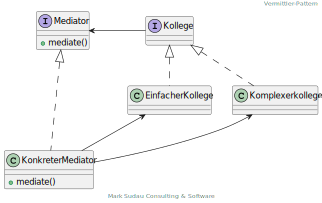

# <mark>Vermittler-Pattern (engl. Mediator)

Der Vermittler definiert die Schnittstelle zur Kommunikation mit Kollegen. Der konkrete Vermittler implementiert das
kooperative Verhalten durch Koordination der beteiligten Kollegen. Er kennt und verwaltet beteiligte Kollegen. Die
einzelnen Kollegen kennen ihren Vermittler und kommunizieren mit ihm statt mit anderen Kollegen.

Der Vermittler findet Anwendung, wenn
 + Objekte in einem System auf komplexe Art und Weise kooperieren,
 + die Wiederverwendung von Objekten durch den Bezug auf viele andere Objekte erschwert wird,
 + oder Objekte andere Objekte, mit denen sie kooperieren, nicht kennen können oder sollen.

| Vorteile                                                                                                                                                                                                                                                                                                                                                                                                                                                                                                                                                  | Nachteile                                                                                                                                                                                                                                     |
|--------------------------------------------------------------------------------------------------------------------------------------------------------------------------------------------------------------------------------------------------------------------------------------------------------------------------------------------------------------------------------------------------------------------------------------------------------------------------------------------------------------------------------------------------------------------------------------------|------------------------------------------------------------------------------------------------------------------------------------------------------------------------------------------------------------------------------------------------------------------------------------|
| Die Koordination des kooperativen Verhaltens wird zentral verwaltet. Eine Veränderung des kooperativen Verhaltens kann unabhängig von den beteiligten Kollegen umgesetzt werden. Solche Änderungen des Verhaltens können durch neue konkrete Vermittler erreicht werden. Dadurch wird die Unterklassenbildung eingeschränkt, da die Änderungen nicht in den verschiedenen konkreten Kollegen vorgenommen und dementsprechend viele neue Unterklassen gebildet werden müssen. Das Muster unterstützt eine lose Kopplung zwischen den Kollegen. Das Protokoll der Kollegen wird vereinfacht. | Da der Vermittler ein Verhalten kapselt, das andernfalls auf mehrere Klassen verteilt wird, ist er selbst komplexer als die einzelnen Komponenten es gewesen wären. Es besteht die Gefahr, dass ein monolithischer Programmkomplex entsteht, der schwer wart- und erweiterbar ist. |
