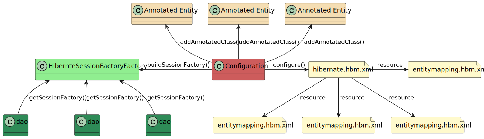

= Lektion 1

== Grundlagen: Hibernate

=== Hibernate Konfiguration
Auch für Hibernate muss, wie überall, die Datenabankbankverbindung konfiguriert werden. Dies geschiet üblicherweise
über die Datei `hibernate.cfg.xml`.

.hibernate.cfg.xml
[source,xml]
----
<?xml version = "1.0" encoding = "utf-8"?>
<!DOCTYPE hibernate-configuration SYSTEM
"http://www.hibernate.org/dtd/hibernate-configuration-3.0.dtd">
<hibernate-configuration>
	<session-factory>
		<!-- Dialect derzu nutzenden Datenbank -->
		<property name="hibernate.dialect">org.hibernate.dialect.H2Dialect</property>
		<!-- Treiber für die Datenbank -->
		<property name="hibernate.connection.driver_class">org.h2.Driver</property>
		<!-- URL der Datenbank -->
		<property name="hibernate.connection.url">jdbc:h2:mem:lecture1</property>
		<!-- Datenbank-User -->
 		<property name="hibernate.connection.username">sa</property>
		<!-- Passwort für den Datenbank-User -->
		<property name="hibernate.connection.password" />
		<!--
		 Konfiguration, wie Hibernate mit den DDL Informationen umgeben soll:
		 create, create-drop, update, validate
		-->
		<property name="hbm2ddl.auto">create-drop</property>
		<!-- List of XML mapping files -->
		<!-- <mapping resource="Employee.hbm.xml" /> -->
	</session-factory>
</hibernate-configuration>
----

In der Konfigurationsdatei werden nach der Konfiguration der Datebankverbindung die Mapping Dateien angegeben, die
jeweils eine  Entity der Anwendung beschreiben.

.Todo.hbm.xml
[source,xml]
----
<?xml version = "1.0" encoding = "utf-8"?>
<!DOCTYPE hibernate-mapping PUBLIC
"-//Hibernate/Hibernate Mapping DTD//EN"
"http://www.hibernate.org/dtd/hibernate-mapping-3.0.dtd">

<hibernate-mapping>
   <class name = "Todo" table = "TODOS">
      <!-- Beschreibung der Klasse -->
      <meta attribute = "class-description">
         This class contains the employee detail.
      </meta>
      <!-- id der Entity -->
      <id name = "id" type = "int" column = "id">
         <!-- möglioche Generatoren: native, identitiy, sequence, hilo -->
         <generator class="identitiy"/>
      </id>
      <!-- Definition der Tabellenspalten  -->
      <property name = "title" column = "title" type = "string"/>
   </class>
</hibernate-mapping>
----

Entities müssen aber nicht per XML definiert werden. Sie können auch per Annotationen definiert werden.

.Todo.java
[source,java]
----
@Entity
@Table(name = "todos")
public class Todo implements Serializable {
    @Id
    @GeneratedValue (strategy = GenerationType.IDENTITY)
    private Long id;
    private String title;

    // c-tor, getter, setter und andere Funktionen
}
----

Doch wie kommt die Konfiguration in den Code, damit eine Datenbankverbindung aufgebaut werden kann? Um das zu
erklären, muss man zu nächst wissen, dass Hibernate mit einer SessionFactory arbeitet.

.erstellen einer SessionFactory
--

--
In der Dokumentation wird hier
meist die Klasse `HibernateUtil` genannt. wen man sich die Funktionalität der Klasse aber mal anschaut, so ist es
genau genommen eine `HibernateSessionFactoryFactory`. In dieser Datei wird die SessionFactory erzeugt und konfiguriert.

.HibernateSessionFactoryFactory
[source,java]
----
public final class HibernateSessionFactoryFactory {

    private static SessionFactory factory;

    private HibernateSessionFactoryFactory () {}

    public static synchronized SessionFactory getSessionFactory () {
        if (factory == null) {
            factory = new Configuration()
                    // laden der Konfiguration
                    .configure("de/mscs/katas/hibernate/lecture1/hibernate.cfg.xml")
                    // deklaration der Annotierten Klassen (mapping Dateien werden über die Konfiguration deklariert)
                    .addAnnotatedClass(Todo.class)
                    // erstellen der SessionFactory
                    .buildSessionFactory();
        }
        return factory;
    }

    /**
     * kontrolliertes Herunterfahren der SessionFactory
     */
    public static void shutdown () {
        if (!factory.isClosed()) {
            factory.close();
        }
        factory = null;
    }
}
----

